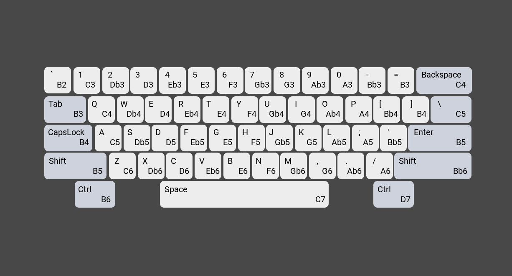

# Atom Code Music

Play music notes like a piano while coding in Atom.

`Ctrl` + `Alt` + `m` `t` or use command `atom-code-music:toggle` to toggle.

Default is Music Box Mode, you can also switch to Real Piano Mode in Settings.

You can also choose timbre (Piano/Marimba) in Settings. But it will use timbre in sheets first, only when timbre in sheets is `""` it will load chosen timbre.

## Key Map in Real Piano Mode.

## The converter and sheets for Music Box Mode.

### How to add custom music sheets.

If you can write music sheets in digit-sheets (For examples see [this repo](https://github.com/AlynxZhou/Harmonica/)), you can use the `atom-code-music:convert` command or `Ctrl` + `Alt` + `m` `c` to convert it into coffeescript/javascript/cson/json array music sheet, which is used to record built-in music sheets.

First write correct digit-sheets with following syntax:

`(low-music-key)` `middle-music-key` `[high-music-key]` `{double-high-music-key}`

`<chord-note1 chord-note2 ...>`

For example:

| Solmization         | Expression          |
| :------------------ | :------------------ |
| C3                  | (1)                 |
| Ab3                 | (#5)                |
| F4                  | 4                   |
| E5                  | [3]                 |
| Bb6                 | {#6}                |
| C5 G5               | [15] or [1][5]      |
| C3 & E4 & Ab5 chord | <(1)3[#5]>          |

**Warning:**

1. Only `<` `>` can be mixed in to the other three brackets, or it will trigger an error.

2. In digit-sheets only `#` is acceptable, no `b`, and never let a `#` control many digits, in other words, `(#1#2#5)` is okay but `#(125)` causes an error.

3. Do not use cross-line brackets, you'd better to close and reopen a pair of brackets at line end/beginning to prevent strange error. (Here line is soft warp in Atom, not hard warp in file.)

**Usage:**

1. Open your digit-sheets, then use command `atom-code-music:convert` or press `Ctrl` + `Alt` + `m` `c`, it will open a untitled buffer and convert it into a coffeescript/javascript array music sheet.

2. Save the array sheet with `.coffee` or `.js`. Add the saved file path into `Settings -> atom-code-music -> Custom Sheets`.
